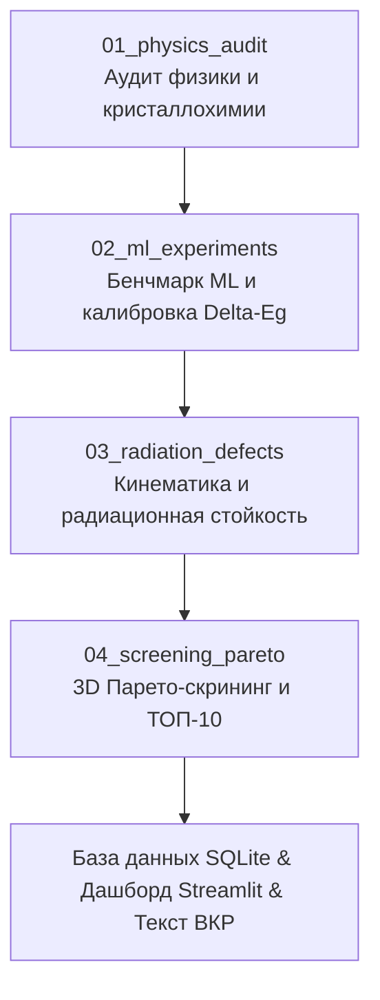

# 🔬 Дорожная карта исследовательских экспериментов и анализа в Jupyter-ноутбуках

**Назначение документа:** Пошаговый научный план исследовательских экспериментов, бенчмаркинга моделей и визуализации для 4 исследовательских ноутбуков проекта.

---

## 🧭 Общая структура исследовательского цикла

Весь исследовательский процесс декомпозирован на 4 последовательных ноутбука, результаты которых напрямую ложатся в главы магистерской диссертации и статьи ВАК/Scopus:

---

## 📘 Ноутбук 1: `notebooks/01_physics_audit/01_crystallography_and_transport.ipynb`
**Тема:** Исследовательский анализ кристаллохимии, электронных свойств и процессов торможения бета-электронов.  
**Входные данные:** `data/02_intermediate/semiconductors_cleaned.parquet` (18 695 фаз) и `semiconductors_unique_ground.parquet` (13 677 составов).  
**Целевая глава ВКР:** Глава 1 (Обзор и постановка задачи) и Глава 2 (Физико-математические модели).

### 📋 Шаги и идеи эксперимента:
1. **Кристаллографический срез датасета:**
   - Построить распределение материалов по 7 кристаллическим сингониям (`crystal_system`: кубическая, гексагональная, тетрагональная и др.).
   - Сравнить соотношение прямозонных (`is_gap_direct = True`) и непрямозонных полупроводников внутри каждой сингонии.
   - *Научный вывод:* Выявить, какие решетки чаще обеспечивают высокую плотность и прямозонность, критичные для собирания заряда.
2. **Экспериментальные vs чисто теоретические структуры:**
   - Разделить датасет по флагу `has_icsd` (экспериментально синтезированные образцы из базы ICSD vs предсказанные DFT).
   - Сравнить распределения $E_g^{DFT}$, плотности и термодинамической стабильности $E_{above\_hull}$.
3. **Физика торможения (Модель Джоя-Ло vs NIST ESTAR):**
   - Реализовать расчет тормозной способности $-\frac{dE}{dx}$ по формуле Джоя-Ло:
     $$-\frac{dE}{dx} = 78.5 \cdot \frac{\rho \cdot Z_{eff}}{A_{eff} \cdot E} \cdot \ln\left[1.166 \cdot \frac{E + 0.73 J}{J}\right]$$
   - Построить профили торможения для эталонных полупроводников ($Si, C, GaAs, GaN, CdTe$) в диапазоне энергий $1 - 250$ кэВ.
   - Сравнить с табличными данными NIST ESTAR и численно оценить погрешность приближения Джоя-Ло.
4. **Закон пробегов электронов (Формула Фельдмана):**
   - Рассчитать глубину пробега $R_\beta(\rho, \bar{E}_\beta) = 0.04 \cdot \bar{E}_\beta^{1.75} / \rho$ для 4 изотопов ($^{63}\text{Ni}, ^{3}\text{H}, ^{14}\text{C}, ^{147}\text{Pm}$).
   - Построить 2D scatter-plot: плотность материала $\rho$ vs глубина проникновения $R_\beta$.
   - Определить оптимальную толщину полупроводникового конвертера под каждый изотоп.

---

## 🧠 Ноутбук 2: `notebooks/02_ml_experiments/02_delta_learning_benchmark.ipynb`
**Тема:** Сравнительный бенчмарк методов квантово-машинной калибровки ($\Delta$-Learning) и SHAP-анализ.  
**Входные данные:** `data/04_external/matbench_expt_gap.parquet` (экспериментальные данные), `data/03_features/features_magpie.parquet`.  
**Целевая глава ВКР:** Глава 3 (Методы машинного обучения и квантовая калибровка).

### 📋 Шаги и идеи эксперимента:
1. **Генерация 135 признаков (Featurization):**
   - Расчет 132 дескрипторов состава Magpie через Matminer (статистики атомных радиусов, электроотрицательностей, энергий ионизации, валентных электронов).
   - Добавление 3 квантово-структурных признаков: $E_g^{DFT}$, плотность $\rho$, объем ячейки $V$.
2. **Сравнительный бенчмарк 4 моделей (5-Fold Cross-Validation):**
   Провести честное сравнение на одной и той же стратифицированной 5-кратной кросс-валидации (`random_state=42`):
   * **Модель 1 (DFT Baseline, без ML):** Прямое сопоставление $E_g^{DFT}$ с экспериментом.  
     *Ожидаемый результат:* $\text{MAE} \approx 1.05\text{ эВ}, R^2 \approx 0.58$ (демонстрация систематического занижения DFT).
   * **Модель 2 (Direct ML, наивный подход):** Обучение CatBoost предсказывать $E_g$ напрямую из дескрипторов Magpie, игнорируя DFT.  
     *Ожидаемый результат:* $\text{MAE} \approx 0.65-0.75\text{ эВ}, R^2 \approx 0.75$.
   * **Модель 3 ($\Delta$-ML на Random Forest):** Классический случайный лес, предсказывающий поправку $\Delta E_g = E_g^{exp} - E_g^{DFT}$.  
     *Ожидаемый результат:* $\text{MAE} \approx 0.45\text{ эВ}, R^2 \approx 0.88$.
   * **Модель 4 ($\Delta$-ML на CatBoost, наш чемпион):** Градиентный бустинг CatBoost над симметричными деревьями решений.  
     *Ожидаемый результат:* $\text{MAE} \approx 0.35\text{ эВ}, R^2 \approx 0.93$ (снижение ошибки на 66%!).
3. **Сводная таблица метрик (MAE, RMSE, $R^2$) и графики четности (Parity Plots):**
   - Построить графики «Эксперимент vs Предсказание» для всех 4 подходов с доверительными интервалами $\pm 0.5$ эВ.
   - Сформировать красивую сводную таблицу для текста диплома.
4. **Объяснимый ИИ (XAI / TreeSHAP анализ):**
   - Рассчитать точные значения Шепли для CatBoost.
   - Построить **SHAP Beeswarm Plot (Топ-15 признаков)**: показать, какие физико-химические свойства кристаллов сильнее всего корректируют погрешность DFT (поляризуемость, ионность связи по Полингу, локализация d/f-оболочек).
   - Построить графики частной зависимости (SHAP Dependence Plots) для ключевых дескрипторов.
5. **Массовая калибровка датасета:**
   - Применить обученную модель ко всем 18 695 полупроводникам:
     $$E_g^{calib} = \max\left(0.1,\, E_g^{DFT} + \Delta E_g^{ML}\right)$$
   - Сохранить откалиброванный датасет: `data/03_features/materials_calibrated.parquet`.

---

## ☢️ Ноутбук 3: `notebooks/03_radiation_defects/03_radiation_hardness_map.ipynb`
**Тема:** Моделирование радиационной стойкости, порогов смещения атомов $E_d$ и релятивистской кинематики $T_{max}$.  
**Входные данные:** `data/03_features/materials_calibrated.parquet`.  
**Целевая глава ВКР:** Глава 4 (Радиационная кинематика и дефектообразование).

### 📋 Шаги и идеи эксперимента:
1. **Расчет пороговой энергии смещения $E_d$ (Модель Ван-Вехтена / Киттеля):**
   - Расчет энергии когезии решетки:
     $$E_{coh} = \sum c_i E_{coh,i}^{elem} + |\Delta H_f|$$
   - Расчет пороговой энергии образования дефекта по Френкелю:
     $$E_d = 8.0 + 1.8 \cdot E_g^{calib} + 2.0 \cdot E_{coh} + 0.002 \cdot T_m \quad (\text{эВ})$$
   - Расчет относительного индекса стойкости: $R_{score} = (E_d / E_d^{diamond}) \cdot 100\%$.
2. **Релятивистская кинематика отдачи $T_{max}$ (Соударение электрона с ядром):**
   - Точная кинематическая формула лобового упругого удара:
     $$T_{max} = \frac{2 E_{max} (E_{max} + 2 m_e c^2)}{M_{nucleus} c^2} \cdot 10^3 \quad (\text{эВ})$$
3. **🔥 Ключевой научный эксперимент: Средняя масса $A_{eff}$ против легкой подрешетки $A_{min}$:**
   - В большинстве простых статей считают отдачу на среднюю массу $A_{eff}$.
   - Мы проведем строгое исследование: сравним $T_{max}(A_{eff})$ и $T_{max}(A_{min})$.
   - *Пример:* В $SiC$ углерод ($A=12$) получает импульс в 2.3 раза больший, чем кремний ($A=28$). В $GaN$ азот выбивается в 5 раз легче, чем галлий!
   - Построить сравнительную диаграмму: сколько полупроводников признаются ложно «радиационно-стойкими», если наивно усреднять массу, и сколько реально сохраняют неуязвимость $T_{max}^{light} < E_d$.
4. **«Радиационная карта материалов» под 4 изотопа:**
   - Построить 2D диаграмму рассеяния: Порог смещения $E_d$ vs Максимальная отдача $T_{max}$.
   - Нанести горизонтальные линии отсечки для $^{63}\text{Ni}$, $^{3}\text{H}$, $^{14}\text{C}$, $^{147}\text{Pm}$.
   - Сформировать кластеры абсолютно радиационно-неуязвимых материалов.

---

## 🏆 Ноутбук 4: `notebooks/04_screening_pareto/04_pareto_screening_and_top_selection.ipynb`
**Тема:** Многокритериальная Парето-оптимизация и отбор ТОП-10 полупроводников для ядерных батарей.  
**Входные данные:** Финальные расчетные таблицы характеристик.  
**Целевая глава ВКР:** Глава 5 (Скрининг, Парето-фронт и практические рекомендации).

### 📋 Шаги и идеи эксперимента:
1. **Моделирование электрофизических параметров (Модель Шокли–Олсена):**
   - Расчет энергии образования пары электрон-дырка по правилу Кляйна:
     $$\varepsilon_{ehp} = 2.8 \cdot E_g^{calib} + 0.55 \quad (\text{эВ})$$
   - Расчет предельного напряжения холостого хода с учетом микротокового режима:
     $$V_{oc}(E_g) = E_g \cdot 0.72 \cdot \frac{1 - \exp(-E_g / 0.75)}{1 + (E_g / 5.2)^{4.5}}$$
   - Расчет теоретического КПД $\eta_{theor} = (V_{oc} / \varepsilon_{ehp}) \cdot FF \cdot 100\%$ ($FF = 0.85$).
2. **3D Парето-оптимизация (Векторная недоминируемость):**
   - Сформулировать 3 взаимно-конфликтующих критерия оптимизации:
     1. $\eta_{theor} \to \max$ (максимум электрической мощности);
     2. $R_{score} \to \max$ (максимальный ресурс и срок службы, десятилетия без деградации);
     3. $R_\beta \to \min$ (минимальная толщина кристалла для микроминиатюризации батареи).
   - Реализовать строгий алгоритм дискретного Парето-отбора (выделение точек 1-го и 2-го рангов недоминируемости).
3. **Интерактивная 3D визуализация Парето-фронта (Plotly):**
   - Построить 3D график Парето-фронта в координатах $[\eta,\, R_{score},\, R_\beta]$ с цветовой шкалой по $E_{above\_hull}$.
   - Выделить на графике положение мировых эталонов ($Si, GaAs, GaN, SiC, Diamond, CdTe$).
4. **Формирование ТОП-10 полупроводников индивидуально под каждый из 4 изотопов:**
   * **ТОП-10 под $^{3}\text{H}$ (Тритий, $\bar{E}_\beta = 5.7$ кэВ, мягкий спектр):** здесь радиационная стойкость почти гарантирована для всех, приоритет — максимальный КПД $\eta$ и малый пробег.
   * **ТОП-10 под $^{63}\text{Ni}$ (Никель-63, $\bar{E}_\beta = 17.4$ кэВ, $T_{1/2} = 100$ лет):** золотая середина между КПД и стойкостью на 100 лет работы.
   * **ТОП-10 под $^{14}\text{C}$ (Углерод-14, $E_{max} = 156.5$ кэВ, $T_{1/2} = 5730$ лет):** жесткий спектр, отсекаются материалы с легкими атомами и низким $E_d$.
   * **ТОП-10 под $^{147}\text{Pm}$ (Прометий-147, $E_{max} = 224$ кэВ):** экстремальный порог дефектообразования, выживают только сверхпрочные матрицы.
5. **Экспорт данных:**
   - Сохранение итоговой библиотеки в SQLite `data/05_database/betavoltaic_library.db` для работы веб-дашборда Streamlit.
   - Экспорт готовых публикационных таблиц в LaTeX и Markdown в `reports/tables/`.

---

## 🎯 Сводная матрица: Как ноутбуки формируют структуру ВКР

| Ноутбук | Научный результат | Графики и таблицы | Раздел диплома / статьи |
|---|---|---|---|
| **`01_physics_audit`** | Кристаллографический профиль базы, верификация Джоя-Ло против NIST | Профили $-\frac{dE}{dx}$, гистограммы $E_g$ по сингониям, $R_\beta(\rho)$ | Раздел 1.3, Раздел 2.2 |
| **`02_ml_experiments`** | Сравнительный бенчмарк 4 моделей, SHAP-анализ важности элементов, калибровка | Parity plots (4 шт.), SHAP Beeswarm plot, таблица MAE/RMSE/$R^2$ | Раздел 3.2, Раздел 3.3 |
| **`03_radiation_defects`** | Модель $T_{max}(A_{min})$, радиационная карта, выявление ложной стойкости | Диаграмма $E_d$ vs $T_{max}$, сравнение $A_{eff}$ vs $A_{min}$ | Раздел 4.1, Раздел 4.2 |
| **`04_screening_pareto`** | 3D Парето-фронт, ТОП-10 полупроводников под 4 изотопа | Интерактивный 3D-фронт, лепестковые диаграммы ТОП-кандидатов | Раздел 5.1, Раздел 5.2 |
